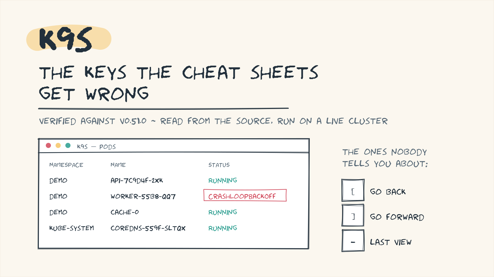
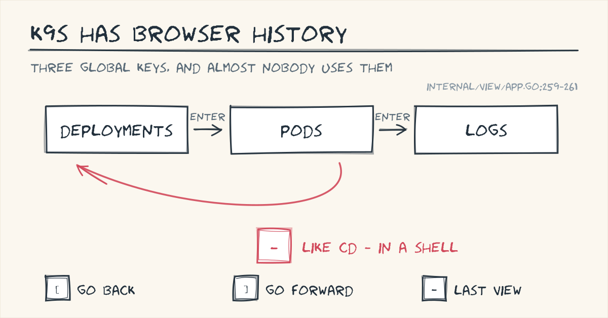
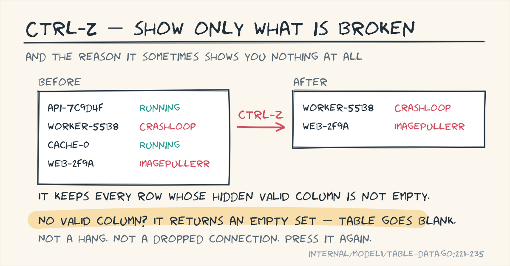
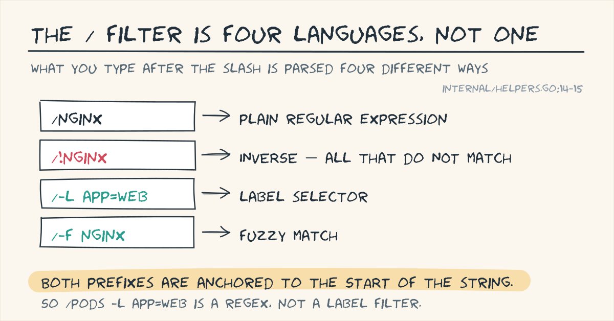

# k9s: the keys the cheat sheets get wrong

Search for a k9s cheat sheet and you get the same twelve keys, copied between
posts for years. Some of them are now wrong.

The most-repeated one is `:popeye`. In k9s v0.51.0 the string "popeye" does not
appear in a single Go file in the repository. I checked the whole tree.

So I stopped reading cheat sheets. I cloned k9s at the v0.51.0 tag, ran that
exact binary against a live cluster, and read the key-binding tables in the
source. Three things came out of it that I had not seen written up properly.

---

## 1. k9s has browser history

`[` goes back. `]` goes forward. `-` jumps to the last view, exactly like
`cd -` in a shell.

Deployments, into pods, into logs — then `-` and you are back at deployments
without retyping `:deploy`. It is the single habit from this list that changes
how fast you move.

One catch, and it is in the source: these only fire when you are **not** inside
a `:` prompt. In command mode, `[` is just a bracket.

## 2. Ctrl-Z shows you only what is broken

`Ctrl-Z` filters the table to the rows k9s considers faulty. Brilliant during an
incident.

The mechanism explains the failure mode. k9s keeps a hidden `VALID` column, and
`Ctrl-Z` keeps rows where it is non-empty. **If the current view has no `VALID`
column, the function returns an empty set and your table goes blank.**

That is not a hang and not a lost connection. It reads exactly like a bug until
you find the four lines that do it. Press it again to come back.

## 3. The `/` filter is four languages, not one

Type `/` and what comes next is parsed four different ways — plain regex, `!`
for inverse, `-l` for a label selector, `-f` for fuzzy.

`/!kube-` to hide system noise is the one I would put on a sticky note.

The detail that costs people time: both prefixes are anchored to the **start**
of the string. `/pods -l app=web` is not a label filter. It is a regex, and it
will quietly find nothing.

---

## On `:popeye`

Popeye still exists as a separate CLI. It is the k9s *integration* that is gone —
absent from v0.51.0, whatever the tutorials say.

I could not determine which release removed it. I worked from a shallow clone
with no history to bisect, so I am not going to guess a version number. Absent
in v0.51.0 is what I can prove, so it is all I will claim.

---

## How this was verified

Source read at the `v0.51.0` tag, then re-checked against current `master`.
Binary run against a local kind cluster. Every claim above carries a file-and-line
citation in the long version, so anyone can check my work — or open an issue
when I get something wrong.

**Long version, with citations:**
https://github.com/meshekar51/k9s/tree/master/field-notes

If you are on a different release, `Ctrl-A` and `?` are the two keys that tell
you the truth for your build. Trust those over any cheat sheet, this one
included.

*What is the k9s key you wish you had learned a year earlier?*

---

*k9s is by Fernand Galiana and its contributors, Apache-2.0. These are
independent field notes, not affiliated with the project.*
